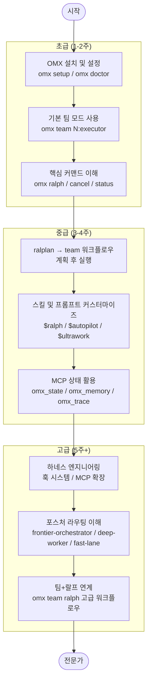
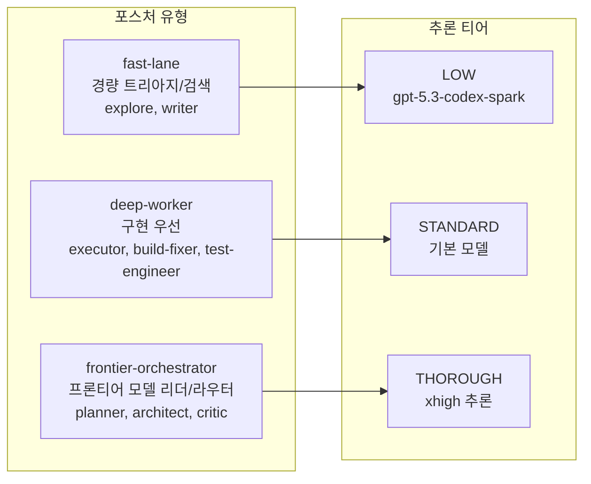
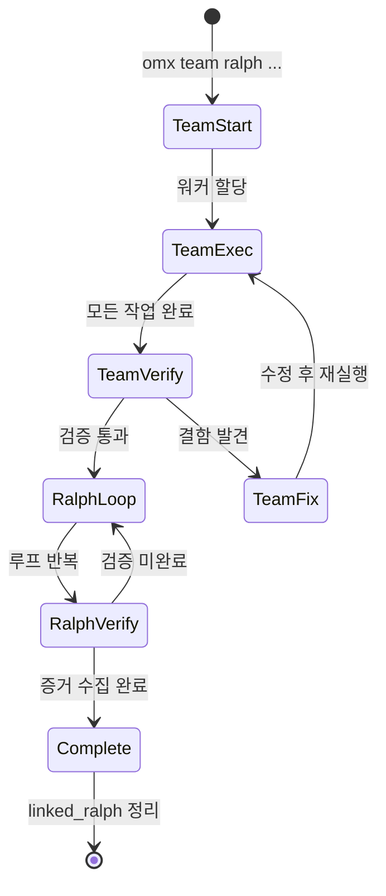
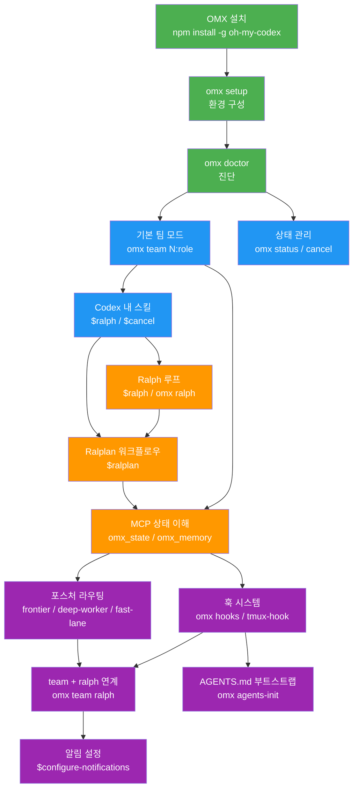

# OMX 학습 경로

이 문서는 oh-my-codex(OMX)를 처음 접하는 사용자부터 하네스 엔지니어링까지 아우르는 단계별 학습 경로를 제공합니다.

---

## 학습 경로 개요



---

## 초급 (1-2주)

초급 단계에서는 OMX를 설치하고, 기본 팀 모드를 실행하며, 핵심 커맨드를 익힙니다.

### 학습 목표

- OMX가 무엇인지, Codex CLI와 어떤 관계인지 이해
- `omx setup`으로 환경 구성
- `omx team`으로 첫 번째 멀티 에이전트 작업 실행
- `omx doctor`로 문제 진단

### 1-1. OMX 설치 및 설정

**사전 요구사항 확인**

```bash
# Node.js 버전 확인 (20 이상 필요)
node --version

# Codex CLI 설치
npm install -g @openai/codex

# tmux 설치 확인
tmux -V
```

**OMX 설치**

```bash
npm install -g oh-my-codex
```

**설정 실행**

```bash
# user 스코프 설치 (전역, 권장 시작점)
omx setup

# 또는 project 스코프 설치 (현재 프로젝트만)
omx setup --scope project
```

`omx setup`이 하는 일:
- `~/.codex/prompts/`에 역할 프롬프트 설치 (architect, planner, executor 등)
- `~/.agents/skills/`에 스킬 설치 (ralph, autopilot, team 등)
- `~/.codex/config.toml` 구성
- `.omx/` 런타임 디렉토리 생성

**설치 검증**

```bash
# 기본 진단
omx doctor

# Team Mode 진단 (tmux 포함)
omx doctor --team
```

> **팁:** `omx doctor --team`이 모두 통과할 때까지 다음 단계로 넘어가지 마세요. tmux 설치 오류가 가장 흔한 문제입니다.

**버전 확인**

```bash
omx version
```

### 1-2. 기본 팀 모드 사용

**첫 번째 팀 실행**

```bash
# 2명의 executor로 간단한 작업 실행
omx team 2:executor "README.md 파일을 검토하고 개선 사항을 제안하라"
```

명령어 구조:
```
omx team <워커수>:<역할> "<작업 설명>"
```

**팀 상태 확인**

```bash
# 팀 이름은 실행 시 출력됨
omx team status <team-name>
```

**팀 종료**

```bash
omx team shutdown <team-name>
```

> **주의:** 작업이 `in_progress` 상태인 동안에는 종료하지 마세요. 중단이 필요한 경우가 아니라면, 작업이 완료될 때까지 기다리세요.

**팀 재개 (중단된 경우)**

```bash
omx team resume <team-name>
# 또는 마지막 세션 재개
omx resume --last
```

### 1-3. 핵심 커맨드 이해

초급 단계에서 알아야 할 커맨드:

| 커맨드 | 설명 |
|--------|------|
| `omx` | HUD와 함께 Codex 실행 |
| `omx setup` | OMX 구성 요소 설치 |
| `omx doctor` | 설치 진단 |
| `omx team N:role "task"` | N명의 역할 워커로 팀 실행 |
| `omx team status <name>` | 팀 상태 확인 |
| `omx team shutdown <name>` | 팀 종료 |
| `omx status` | 활성 모드 확인 |
| `omx cancel` | 활성 모드 취소 |
| `omx help` | 도움말 |

**Codex 내에서 스킬 사용**

```text
$ralph "이 작업이 완료될 때까지 지속하라"
$cancel
```

### 초급 체크리스트

- [ ] `omx doctor --team` 모든 항목 통과
- [ ] `omx team 2:executor "..."` 첫 팀 실행 성공
- [ ] `omx team status`로 진행 상태 확인
- [ ] `omx team shutdown`으로 팀 정상 종료

---

## 중급 (3-4주)

중급 단계에서는 ralplan→team 워크플로우, 스킬/프롬프트 커스터마이즈, MCP 상태 활용을 익힙니다.

### 학습 목표

- ralplan으로 구조화된 계획 수립
- team과 연계하여 계획 실행
- 스킬과 역할 프롬프트를 상황에 맞게 선택
- MCP 서버를 통한 상태와 메모리 이해

### 2-1. ralplan → team 워크플로우

이것이 OMX의 **권장 고제어 워크플로우**입니다.

**왜 이 조합인가?**

- `ralplan`은 거친 요청을 스펙과 수용 기준, 레인별 분해로 변환합니다
- `$team`은 그 계획을 영속 워커 조율과 함께 실행합니다
- `$ralph`는 검증이 실재할 때까지 루프를 유지합니다

**실행 예시**

```bash
# 1단계: ralplan으로 계획 수립
omx ask --agent-prompt planner "ralplan: OAuth 콜백 기능을 워커 레인과 수용 기준으로 분해하라"

# 계획 결과물 확인
ls .omx/plans/

# 2단계: team으로 실행
omx team 3:executor "승인된 ralplan을 공유 런타임 조율로 실행하라"
```

Codex 내에서:

```text
ralplan: 이 기능을 구현 레인으로 분해하라
$team 3:executor "위의 ralplan을 기반으로 구현하라"
$ralph "검증 완료 시까지 루프"
```

> **팁:** ralplan 결과물(`.omx/plans/prd-*.md`, `.omx/plans/test-spec-*.md`)이 생성된 후에만 team을 실행하세요. Ralph가 활성화된 경우, 계획 없이는 구현을 시작할 수 없습니다.

### 2-2. 스킬 및 프롬프트 커스터마이즈

**사용 가능한 스킬 목록**

```text
# Codex 내에서 스킬 목록 확인
/skills
```

핵심 스킬:

| 스킬 | 트리거 | 설명 |
|------|--------|------|
| `$autopilot` | "autopilot", "build me" | 아이디어에서 동작하는 코드까지 자율 실행 |
| `$ralph` | "ralph", "don't stop" | 검증이 완료될 때까지 루프 유지 |
| `$ultrawork` | "ultrawork", "ulw" | 병렬 에이전트로 최대 병렬성 |
| `$team` | "team", "swarm" | 구조화된 멀티 에이전트 조율 |
| `$plan` | "plan this", "plan the" | 전략적 계획 수립 |
| `$ralplan` | "ralplan", "consensus plan" | RALPLAN-DR 구조화된 숙의 계획 |
| `$ultraqa` | "ultraqa" | QA 사이클: 테스트, 검증, 수정 반복 |
| `$cancel` | "cancel", "stop", "abort" | 활성 모드 취소 |

**역할 프롬프트 사용**

```text
# Codex 내에서 역할 프롬프트 호출
/prompts:executor "다음 작업 수행"
/prompts:architect "설계 검토"
/prompts:planner "계획 수립"
/prompts:verifier "완료 검증"
```

**에이전트 카탈로그**

| 역할 | 설명 | 복잡도 |
|------|------|--------|
| `explore` | 빠른 코드베이스 검색 및 매핑 | 낮음 |
| `writer` | 문서, 마이그레이션 노트 | 낮음 |
| `executor` | 구현 및 리팩토링 | 표준 |
| `debugger` | 근본 원인 분석 | 표준 |
| `test-engineer` | 테스트 전략 및 커버리지 | 표준 |
| `planner` | 작업 계획 및 시퀀싱 | 높음 |
| `architect` | 시스템 설계, 트레이드오프 분석 | 높음 |
| `critic` | 계획/설계 비판적 검토 | 높음 |

**로우 토큰 팀 프로파일**

Spark 모델을 사용한 경량 워커:

```bash
OMX_TEAM_WORKER_CLI=codex \
OMX_TEAM_WORKER_LAUNCH_ARGS='--model gpt-5.3-codex-spark -c model_reasoning_effort="low"' \
omx team 2:explore "단기 범위 분석 작업"
```

### 2-3. MCP 상태 활용

OMX는 4개의 MCP 서버를 통해 영속 상태를 관리합니다.

**MCP 서버 역할**

| MCP 서버 | 역할 | 저장 위치 |
|----------|------|-----------|
| `omx_state` | 실행 모드 상태 (team, ralph, ultrawork) | `.omx/state/` |
| `omx_memory` | 크로스 세션 메모리 | `.omx/project-memory.json` |
| `omx_trace` | 추적 및 진단 | `.omx/logs/` |
| `omx_code_intel` | 코드 인텔리전스 | 인메모리 |

**상태 파일 구조**

```
.omx/
├── state/              # 모드 상태 파일
│   ├── team-state.json
│   ├── ralph-state.json
│   └── ultrawork-state.json
├── notepad.md          # 세션 노트
├── project-memory.json # 크로스 세션 메모리
├── plans/              # 계획 문서
│   ├── prd-*.md
│   └── test-spec-*.md
└── logs/               # 로그
```

**MCP workingDirectory 보안 설정 (선택사항)**

```bash
# 허용된 루트 디렉토리 제한
export OMX_MCP_WORKDIR_ROOTS="/path/to/project:/path/to/another-root"
```

**상태 확인 및 디버깅**

```bash
# 활성 모드 상태 확인
omx status

# HUD로 실시간 모니터링
omx hud --watch

# JSON 형식으로 상태 출력
omx hud --json
```

### 중급 체크리스트

- [ ] `ralplan`으로 계획 수립 후 `.omx/plans/`에 결과물 확인
- [ ] `omx team`으로 계획 기반 실행 성공
- [ ] Codex 내에서 `$ralph`로 루프 유지 경험
- [ ] `omx hud --watch`로 실시간 상태 모니터링
- [ ] 역할별 프롬프트(`/prompts:architect` 등) 직접 호출

---

## 고급 (5주+)

고급 단계에서는 하네스 엔지니어링, 포스처 라우팅, team+ralph 연계 고급 워크플로우를 마스터합니다.

### 학습 목표

- 훅 시스템으로 OMX 동작 커스터마이즈
- MCP 서버 확장 이해
- 포스처 라우팅 원리 이해 및 활용
- `omx team ralph` 연계 생명주기 관리

### 3-1. 하네스 엔지니어링

**훅 시스템 개요**

OMX는 두 가지 훅 메커니즘을 제공합니다:

```bash
# tmux-hook (기존, 안정적)
omx tmux-hook init
omx tmux-hook status
omx tmux-hook validate

# hooks (신규, 플러그인 확장)
omx hooks init
omx hooks status
omx hooks validate
```

플러그인 파일 위치: `.omx/hooks/*.mjs`

플러그인 활성화:

```bash
export OMX_HOOK_PLUGINS=1
```

> **팁:** `omx tmux-hook`은 그대로 유지됩니다. `omx hooks`는 추가적(additive)이며 기존 워크플로우를 대체하지 않습니다.

**AGENTS.md 오버레이 시스템**

OMX는 Codex 실행 시 자동으로 AGENTS.md를 주입합니다:

```bash
# 기본: AGENTS.md 주입 활성화
omx  # -c model_instructions_file="<cwd>/AGENTS.md" 자동 추가

# AGENTS.md 주입 비활성화
OMX_BYPASS_DEFAULT_SYSTEM_PROMPT=0 omx

# 커스텀 지시 파일 사용
OMX_MODEL_INSTRUCTIONS_FILE=/path/to/instructions.md omx
```

**AGENTS.md 부트스트랩**

신규 저장소에 AGENTS.md를 빠르게 생성:

```bash
# 현재 디렉토리에 AGENTS.md 생성
omx agents-init .

# 드라이런으로 변경 사항 미리 확인
omx agents-init ./src --dry-run

# 기존 파일 강제 덮어쓰기
omx agents-init . --force
```

`omx agents-init`의 특징:
- 대상 디렉토리와 1단계 하위 디렉토리에 AGENTS.md 생성
- `.git`, `.omx`, `node_modules`, `dist`, `build` 등 제외
- `<!-- OMX:AGENTS-MANUAL:* -->` 섹션 유지

**알림 설정**

```text
# Codex 내에서 알림 설정
$configure-notifications "discord 알림 설정"
$configure-notifications "slack 알림 설정"
$configure-notifications "openclaw 알림 설정"
```

OpenClaw 명령 게이트웨이 환경 변수:

```bash
export OMX_OPENCLAW=1
export OMX_OPENCLAW_COMMAND=1
```

### 3-2. 포스처 라우팅 이해

**포스처 시스템**

포스처는 에이전트의 운영 스타일을 정의합니다. 3가지 차원으로 구성됩니다:

```
role (책임) x tier (추론 깊이) x posture (스타일)
```

**포스처별 특성**



**포스처별 적합 역할**

| 포스처 | 적합 역할 | 추론 티어 | 사용 시점 |
|--------|-----------|-----------|-----------|
| `frontier-orchestrator` | planner, architect, critic | THOROUGH | 전략적 결정, 설계 검토 |
| `deep-worker` | executor, build-fixer, test-engineer | STANDARD | 구현, 버그 수정, 테스트 |
| `fast-lane` | explore, writer | LOW | 검색, 문서 작성 |

**포스처 실험 테스트**

```bash
# 프로젝트 빌드
npm run build

# 네이티브 에이전트 설정 재설치
node bin/omx.js setup

# 생성된 설정 확인
ls ~/.omx/agents/
# 각 파일에 다음 섹션이 포함되어야 함:
# - ## OMX Posture Overlay
# - ## Model-Class Guidance
# - ## OMX Agent Metadata

# 포스처 테스트 실행
node --test dist/agents/__tests__/definitions.test.js dist/agents/__tests__/native-config.test.js
```

### 3-3. team + ralph 연계 고급 워크플로우

**omx team ralph의 핵심 이점**

`omx team ralph`는 팀 실행과 Ralph 사후 처리를 **하나의 연계된 생명주기**로 묶습니다. 단순히 `omx team` 후 `omx ralph`를 따로 실행하는 것과는 다릅니다.

**연계 생명주기 다이어그램**



**연계 생명주기의 차이점**

| 동작 | 일반 team | Ralph team |
|------|-----------|------------|
| 강제 종료 시 | `shutdown_gate_blocked` 발생 | 게이트 우회, `ralph_cleanup_policy` 기록 |
| 자동 브랜치 삭제 | 롤백 시 삭제 | 브랜치 보존 (`skipBranchDeletion`) |
| 완료 로깅 | 표준 `shutdown_gate` 이벤트 | 추가 `ralph_cleanup_summary` (작업 분류 포함) |

**워커 CLI 선택 전략**

```bash
# 기본: auto (워커 모델에 "claude" 포함 시 claude CLI 사용)
OMX_TEAM_WORKER_CLI=auto omx team ...

# Codex CLI 강제
OMX_TEAM_WORKER_CLI=codex omx team ...

# Claude CLI 강제
OMX_TEAM_WORKER_CLI=claude omx team ...

# 워커별 CLI 혼합 (워커 수와 길이 일치 필요)
OMX_TEAM_WORKER_CLI_MAP=codex,codex,claude,claude omx team 4:executor ...

# 적응형 큐 재시도 비활성화
OMX_TEAM_AUTO_INTERRUPT_RETRY=0 omx team ...
```

**워커 모델 우선순위**

```
1. OMX_TEAM_WORKER_LAUNCH_ARGS의 명시적 모델
2. 리더 --model 상속
3. OMX_SPARK_MODEL의 저복잡도 기본 모델 (현재: gpt-5.3-codex-spark)
```

**고급 팀 시나리오**

```bash
# 시나리오 1: 고추론 팀 (복잡한 리팩토링)
omx --xhigh team 4:executor "20개 모듈 전체 리팩토링"

# 시나리오 2: 혼합 역할 팀
omx team 2:executor "구현" &
omx team 1:verifier "검증" &
# (실제로는 단일 team 커맨드로 역할 지정)

# 시나리오 3: Ralph 연계 (권장)
omx team ralph 3:executor "기능 구현 후 ralph 검증"

# 시나리오 4: 비-tmux 팀 (고급)
OMX_TEAM_WORKER_LAUNCH_MODE=prompt omx team 2:executor "작업"
```

**Visual QA 루프 (시각적 작업용)**

```text
# Codex 내에서
$visual-verdict  # 매 이터레이션 전 실행
# 반환: score, verdict, category_match, differences[], suggestions[], reasoning
# 권장 통과 임계값: 90+
```

### 고급 체크리스트

- [ ] `omx hooks init`으로 플러그인 스캐폴딩 생성
- [ ] `OMX_HOOK_PLUGINS=1`로 플러그인 활성화 테스트
- [ ] `omx agents-init`으로 서브디렉토리 AGENTS.md 생성
- [ ] `omx team ralph`로 연계 생명주기 실행 경험
- [ ] 포스처 라우팅 실험 (`npm run build` 후 확인)
- [ ] `omx ask claude/gemini`로 외부 제공자 활용

---

## 학습 우선순위 의존성 그래프

어떤 개념을 어떤 순서로 학습해야 하는지 보여주는 의존성 그래프입니다.



**범례:**
- 초록 — 초급 필수
- 파랑 — 초급 완성
- 주황 — 중급
- 보라 — 고급

---

## 자주 하는 실수

### 초급 단계

**실수 1: tmux 없이 팀 모드 시도**
```bash
# 오류 발생
omx team 2:executor "작업"
# Error: tmux not found

# 해결
brew install tmux  # macOS
sudo apt install tmux  # Ubuntu
```

**실수 2: 작업 중 팀 강제 종료**
```bash
# 위험: in_progress 작업이 있을 때 shutdown
omx team shutdown <name>  # 작업 손실 가능

# 안전한 방법: 작업 완료 후 종료
omx team status <name>  # 상태 확인 후
omx team shutdown <name>
```

### 중급 단계

**실수 3: ralplan 없이 ralph 활성화 후 구현 시도**

Ralph가 활성화된 상태에서 계획 없이 구현을 시작하면 차단됩니다. `.omx/plans/prd-*.md`와 `.omx/plans/test-spec-*.md`가 먼저 생성되어야 합니다.

```text
# 올바른 순서
$ralplan "기능 계획"    # 먼저 실행
# prd와 test-spec 생성 확인 후
$team 3:executor "구현"
$ralph "검증"
```

**실수 4: `omx team`과 `omx team ralph`를 혼용**

나중에 ralph를 추가하려면 `omx team ralph`로 처음부터 시작해야 합니다. 별도로 실행된 team과 ralph는 연계 생명주기를 공유하지 않습니다.

---

## 다음 단계

이 학습 경로를 마친 후 참고할 자료:

- `02-glossary.md` — 핵심 용어 사전
- [공식 CLI 참조](https://yeachan-heo.github.io/oh-my-codex-website/docs.html#cli-reference)
- [권장 워크플로우](https://yeachan-heo.github.io/oh-my-codex-website/docs.html#workflows)
- [훅 확장 문서](https://github.com/Yeachan-Heo/oh-my-codex/blob/main/docs/hooks-extension.md)
- [OpenClaw 통합 가이드](https://github.com/Yeachan-Heo/oh-my-codex/blob/main/docs/openclaw-integration.md)
