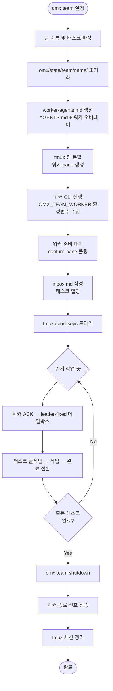
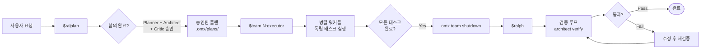
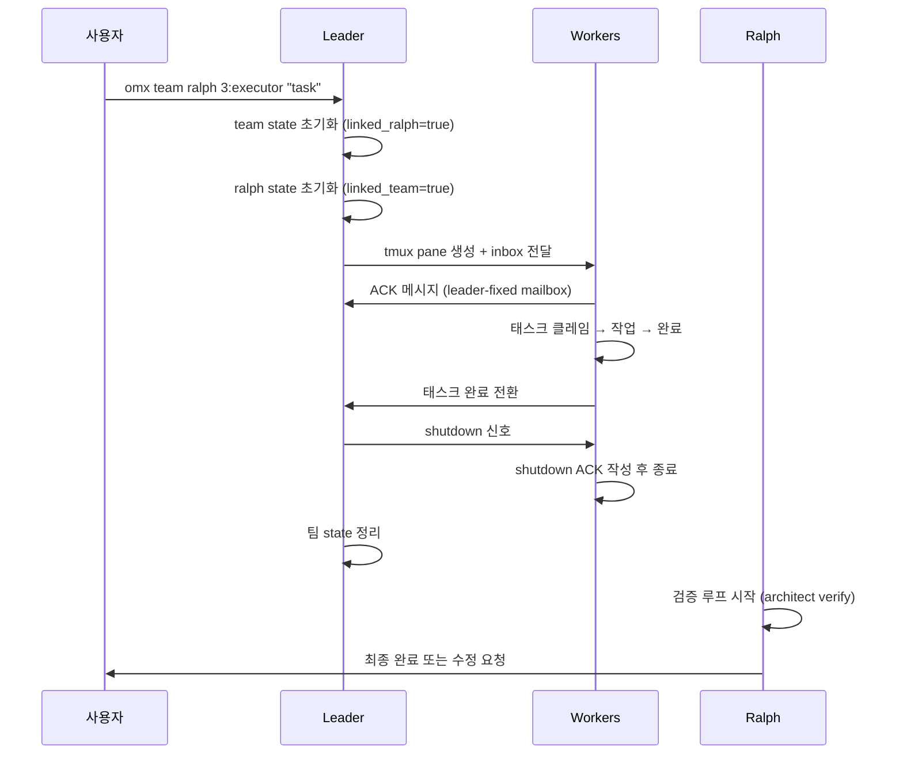

# Team Mode - 멀티 에이전트 오케스트레이션

## 1. Team Mode란?

Team Mode는 oh-my-codex(OMX)의 tmux 기반 병렬 실행 오케스트레이션 서비스다. 여러 Codex 또는 Claude CLI 세션을 tmux 분할 창으로 실행하고, `.omx/state/team/...` 파일과 `omx team api ...` CLI를 통해 워커들을 조율한다.

### Ultrawork와의 차이

| 항목 | Team Mode | Ultrawork |
|------|-----------|-----------|
| 실행 방식 | tmux 분할 창 (별도 CLI 프로세스) | 인-프로세스 에이전트 위임 |
| 역할 | 오케스트레이션 (조율) | 병렬화 (팬아웃) |
| 상태 관리 | `.omx/state/team/<name>/` 파일 시스템 | `.omx/state/ultrawork-state.json` |
| 사용 시점 | 독립 실행 워커가 필요할 때 | 빠른 병렬 에이전트 위임 |
| 컨텍스트 공유 | 공유 state 파일로 조율 | 동일 세션 내 공유 |

Team Mode는 실제 별도 CLI 프로세스를 생성한다. 각 워커는 완전히 독립된 Codex/Claude 세션이다.

---

## 2. 핵심 커맨드

### 기본 호출 형식

```bash
omx team [ralph] [N:agent-type] "<task description>"
```

### 전체 레퍼런스

```bash
# 팀 시작 - 워커 1명 (기본)
omx team "analyze this codebase and report issues"

# 팀 시작 - 워커 N명, 역할 지정
omx team 3:executor "implement feature X in parallel"

# Ralph와 연계 시작
omx team ralph "ship end-to-end fix with verification"

# 상태 확인
omx team status <team-name>

# 활성 팀 재접속
omx team resume <team-name>

# 팀 종료 (모든 워커 완료 후)
omx team shutdown <team-name>

# 이벤트 드리븐 대기
omx team await <team-name> --timeout-ms 30000 --json
```

### CLI API (워커-리더 통신)

```bash
# 메시지 전송
omx team api send-message --input '{"team_name":"my-team","from_worker":"worker-1","to_worker":"leader-fixed","body":"ACK"}' --json

# 태스크 클레임
omx team api claim-task --input '{"team_name":"my-team","task_id":"1","worker":"worker-1"}' --json

# 태스크 상태 전환
omx team api transition-task-status --input '{"team_name":"my-team","task_id":"1","from":"in_progress","to":"completed","claim_token":"<token>"}' --json
```

---

## 3. Team Mode 라이프사이클



### 상태 전환 규칙 (orchestrator.ts 기준)

```mermaid
stateDiagram-v2
    [*] --> team-plan
    team-plan --> team-prd
    team-prd --> team-exec
    team-exec --> team-verify
    team-verify --> team-fix
    team-verify --> complete
    team-verify --> failed
    team-fix --> team-exec
    team-fix --> team-verify
    team-fix --> complete
    team-fix --> failed
    complete --> [*]
    failed --> [*]
    cancelled --> [*]
```

각 페이즈의 권장 에이전트:

| 페이즈 | 권장 에이전트 |
|--------|--------------|
| team-plan | analyst, planner |
| team-prd | product-manager, analyst |
| team-exec | executor, designer, test-engineer |
| team-verify | verifier, quality-reviewer, security-reviewer |
| team-fix | executor, build-fixer, debugger |

팀 fix 루프는 기본 최대 3회(`max_fix_attempts`)로 제한된다. 초과 시 `failed` 상태로 전환한다.

---

## 4. ralplan → team → ralph 워크플로우

가장 강력한 조합이다. ralplan으로 계획하고, team으로 병렬 실행하고, ralph로 완료를 보장한다.



### 사용 예시

```bash
# 1단계: 합의 플래닝
$ralplan "OAuth2 인증 시스템 추가"

# 2단계: 승인 후 팀 실행 (플랜에서 제안된 에이전트 구성 사용)
omx team ralph 3:executor "implement OAuth2 from .omx/plans/oauth2-plan.md"

# 팀 완료 후 ralph가 자동으로 검증 루프 진행
```

💡 **팁**: ralplan이 출력하는 플랜에는 `available-agent-types roster`와 구체적인 `omx team` 런치 힌트가 포함된다. 이를 그대로 사용하면 된다.

---

## 5. team + ralph 연계 모드 (omx team ralph)

### 왜 별도 커맨드인가

`omx team ralph ...`는 단순히 "나중에 ralph 추가"가 아니다. 런치 시점부터 연계된 lifecycle을 생성한다.

- **Linked lifecycle/state**: 팀 런은 `linked_ralph=true`로 마킹, ralph는 `linked_team=true`로 마킹
- **Cleanup/shutdown 순서**: 팀 정리 먼저 → ralph 종료 메타데이터 처리
- **Operator 선택 가이드**:
  - 조율된 워커만 필요: `omx team ...`
  - 지속적 ralph 검증도 필요: `omx team ralph ...`
  - 팀 결과를 보고 ralph를 나중에 별도 실행: 수동 follow-up

### Linked State 관리

```bash
# team+ralph 연계 상태 확인
omx team status <team-name>

# ralph 상태 확인 (연계 여부 포함)
# .omx/state/ralph-state.json 의 linked_team 필드 확인
```

### Ralph Cleanup Policy

| 구분 | 일반 팀 취소 | Ralph 연계 팀 취소 |
|------|-------------|-------------------|
| 팀 state 삭제 | 즉시 | 팀 먼저 종료 후 |
| Ralph state | 독립 | 팀 종료 후 ralph도 terminalize |
| tmux 세션 | 즉시 kill | 워커 graceful shutdown 후 kill |
| skipBranchDeletion | 없음 | ralph linked_team에 기록 |



---

## 6. 워커 설정

### 핵심 환경 변수

```bash
# 워커 CLI 선택 (기본: auto)
# auto: --model에 'claude' 포함 시 claude CLI, 아니면 codex
OMX_TEAM_WORKER_CLI=codex         # 모든 워커를 Codex로
OMX_TEAM_WORKER_CLI=claude        # 모든 워커를 Claude로
OMX_TEAM_WORKER_CLI=auto          # 자동 감지 (기본값)

# 워커별 CLI 매핑 (쉼표 구분, 팀 워커 수와 일치해야 함)
OMX_TEAM_WORKER_CLI_MAP=codex,claude,codex,claude

# 워커에게 전달할 추가 실행 인자
OMX_TEAM_WORKER_LAUNCH_ARGS="--model o4-mini"

# 워커 준비 대기 타임아웃 (기본: 45000ms)
OMX_TEAM_READY_TIMEOUT_MS=60000

# 준비 대기 건너뜀 (디버그 전용)
OMX_TEAM_SKIP_READY_WAIT=1

# auto-trust 프롬프트 자동 진행 비활성화
OMX_TEAM_AUTO_TRUST=0

# 리더 nudge 간격 (기본: 120000ms)
OMX_TEAM_LEADER_NUDGE_MS=60000
```

### --spark 플래그와 모델 라우팅

```bash
# 저비용 모델로 워커 실행 (spark 모델 사용)
OMX_SPARK_MODEL=gpt-5.3-codex-spark omx team 5:executor "task"
```

모델 우선순위 (높은 순):
1. `OMX_TEAM_WORKER_LAUNCH_ARGS`에 명시된 `--model`
2. Leader의 `--model` 플래그 상속
3. `OMX_SPARK_MODEL` (1, 2 없을 때 + 저복잡도 에이전트)

### model_reasoning_effort per worker

```bash
# 명시적 reasoning effort 설정 (모든 워커에 적용)
OMX_TEAM_WORKER_LAUNCH_ARGS="-c model_reasoning_effort=high"

# 미설정 시: 워커 역할(role)에서 동적 할당
# executor → medium, debugger → high, explore → low
```

💡 **중요**: 팀 런타임은 모델 이름(예: `spark`, `mini`)으로 reasoning effort를 추론하지 않는다. 역할 기반 동적 할당 또는 명시적 설정을 사용한다.

### Non-tmux 팀 실행

tmux 없이 에이전트 드리븐 방식으로 팀을 실행할 수 있다:

```bash
# OMX_TEAM_WORKER_LAUNCH_MODE=prompt 설정 시
# 워커를 tmux pane 대신 인터랙티브 프롬프트로 실행
OMX_TEAM_WORKER_LAUNCH_MODE=prompt omx team 2:executor "task"
```

MCP Job 도구를 사용하는 방법도 있다:

```javascript
// 1. 팀 시작 (비동기, jobId 즉시 반환)
omx_run_team_start({
  teamName: "fix-bugs",
  agentTypes: ["codex"],
  tasks: [{ subject: "Fix bug", description: "..." }],
  cwd: "/path/to/project"
})
// → { jobId: "omx-abc123" }

// 2. 완료 대기 (idle pane 자동 nudge 포함)
omx_run_team_wait({ job_id: "omx-abc123", timeout_ms: 300000 })

// 3. 조기 종료 시만 사용
omx_run_team_cleanup({ job_id: "omx-abc123" })
```

| MCP 도구 | 설명 |
|---------|------|
| `omx_run_team_start` | tmux 워커 생성, jobId 즉시 반환 |
| `omx_run_team_status` | 논블로킹 상태 확인 |
| `omx_run_team_wait` | 완료까지 블로킹 대기 |
| `omx_run_team_cleanup` | 조기 종료 시 워커 pane 정리 |

---

## 7. 실전 팀 모드 예시

### 기본 사용 예시

```bash
# 3명 executor 워커로 기능 구현
omx team 3:executor "implement user authentication module"

# 단일 워커 (기본)
omx team "debug flaky integration tests"

# Ralph 연계로 완료 보장
omx team ralph "ship end-to-end fix with verification"
```

### Claude 워커 사용

```bash
# 모든 워커를 Claude CLI로
OMX_TEAM_WORKER_CLI=claude omx team 2:executor "update docs and report"

# 혼합 팀 (Codex + Claude)
OMX_TEAM_WORKER_CLI_MAP=codex,claude omx team 2:executor "split doc/code tasks"
```

### Low-token 프로파일 (비용 절감)

```bash
# spark 모델로 저비용 실행
OMX_TEAM_WORKER_CLI=codex \
OMX_TEAM_WORKER_LAUNCH_ARGS="--model gpt-5.3-codex-spark" \
omx team 4:executor "batch refactor tasks"
```

### 팀 모니터링 루프

```bash
# 팀 상태 주기적 확인 (30초마다)
while true; do
  omx team status my-team
  sleep 30
done

# 또는 이벤트 드리븐 대기
omx team await my-team --timeout-ms 30000 --json
```

### 완료 후 정리

```bash
# 1. 상태 확인 (pending=0, in_progress=0 확인)
omx team status my-team

# 2. 팀 종료
omx team shutdown my-team

# 3. 상태 파일 정리
rm -rf .omx/state/team/my-team/
```

---

## 8. 주요 파일 구조

팀 실행 중 생성되는 파일들:

```
.omx/state/team/<team-name>/
├── config.json                    # 팀 설정 (워커 목록, pane ID 등)
├── manifest.v2.json               # 팀 매니페스트
├── worker-agents.md               # 공통 워커 지시사항 (AGENTS.md + 오버레이)
├── tasks/
│   ├── task-1.json               # 태스크 상태 파일
│   └── task-2.json
├── workers/
│   ├── worker-1/
│   │   ├── identity.json         # 워커 신원
│   │   ├── inbox.md              # 태스크 할당 지시사항
│   │   ├── heartbeat.json        # 생존 신호
│   │   ├── status.json           # 현재 상태 (idle/working/blocked)
│   │   └── AGENTS.md             # 역할별 오버레이 포함
│   └── worker-2/
│       └── ...
├── mailbox/
│   ├── leader-fixed.json         # 워커 → 리더 메시지
│   └── worker-1.json             # 리더 → 워커 메시지
└── dispatch/
    └── requests.json             # 내구성 디스패치 큐
```

💡 **태스크 ID 규칙**: 파일 경로는 `task-<id>.json` (예: `task-1.json`), API 호출 시 `task_id`는 bare id (예: `"1"`, `"task-1"` 아님).

---

## 9. 트러블슈팅

### Clean-Slate 복구

```bash
# 1. 현재 pane 목록 확인
tmux list-panes -F '#{pane_id}\t#{pane_current_command}\t#{pane_start_command}'

# 2. 남은 워커 pane 정리
tmux kill-pane -t %450
tmux kill-pane -t %451

# 3. 팀 state 삭제
rm -rf .omx/state/team/<team-name>

# 4. 재시도
omx team 1:executor "fresh retry"
```

### 워커 ACK가 없을 때

```bash
# 1. 워커 pane 출력 확인
tmux capture-pane -t %<worker-pane> -p -S -120

# 2. 메일박스 파일 확인
cat .omx/state/team/<team>/mailbox/leader-fixed.json

# 3. 워커 상태 파일 확인
cat .omx/state/team/<team>/workers/worker-1/status.json
```

### worker_notify_failed 발생 시

리더가 inbox를 작성했지만 트리거 전송이 실패한 경우:

```bash
tmux list-panes -F '#{pane_id}\t#{pane_start_command}'
tmux capture-pane -t %<worker-pane> -p -S -120
# 워커 프로세스가 살아있는지, trust 프롬프트에 걸려있지 않은지 확인
```
