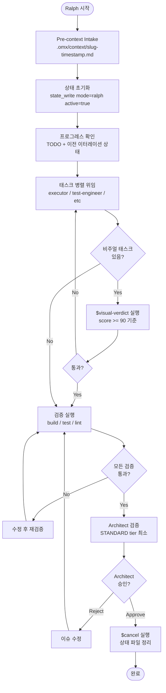
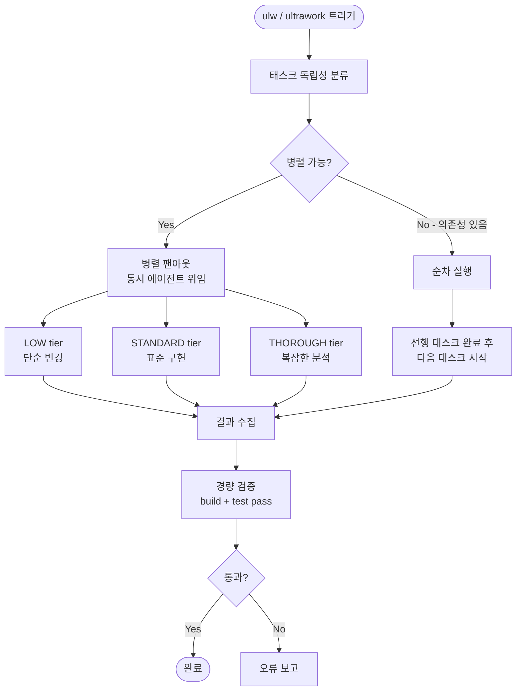
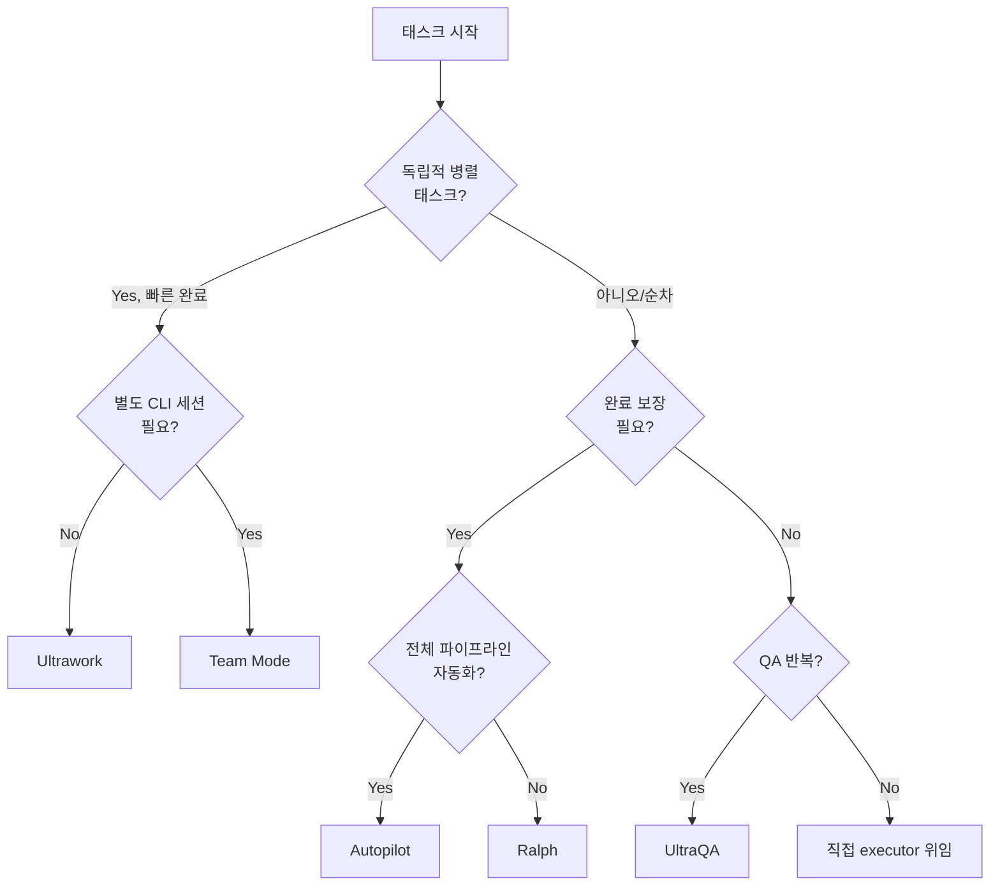

# Ralph & Ultrawork - 지속 실행 루프

## 1. Ralph란?

Ralph는 태스크가 완전히 완료되고 검증될 때까지 반복 실행하는 persistence loop다. 부분 구현이 "완료"로 선언되거나, 테스트가 건너뛰어지거나, 엣지 케이스가 잊히는 것을 방지한다.

### "The boulder never stops" 철학

Ralph는 완료를 보장하는 것이 목표다. 훅 시스템이 "The boulder never stops" 메시지를 보내면 이터레이션을 계속한다. 다음 경우에만 멈춘다:

- 모든 요구사항이 충족되고 architect 검증을 통과했을 때
- 사용자가 "stop", "cancel", "abort"를 말했을 때
- 근본적인 blocker가 발생해 사용자 입력이 필요할 때
- 같은 오류가 3회 이상 반복될 때

### 언제 사용하나

```
ralph 사용 시점:
- 완료가 보장되어야 할 때 ("done"이 아닌 진짜 완료)
- "ralph", "don't stop", "must complete", "finish this", "keep going until done"
- 여러 이터레이션에 걸친 작업에서 재시도 persistence가 필요할 때
- architect 최종 승인이 필요한 작업
```

### omx ralph 커맨드

```bash
# 기본 실행
omx ralph "task description"

# PRD 모드로 실행 (요구사항 문서 먼저 생성)
omx ralph --prd "build a todo app with React and TypeScript"

# 비주얼 레퍼런스와 함께 실행
omx ralph -i refs/design.png "match this design"
omx ralph --images-dir ./screenshots "match all screenshots"

# 스킬로 트리거
$ralph "implement the approved plan"
```

---

## 2. Ralph 실행 Mermaid



### Ralph 페이즈 상태

소스 코드(`ralph/contract.ts`)에서 확인된 실제 페이즈:

| 페이즈 | 의미 |
|--------|------|
| `starting` | 초기화 중 |
| `executing` | 태스크 실행 중 |
| `verifying` | 검증 중 |
| `fixing` | 이슈 수정 중 |
| `complete` | 성공 완료 |
| `failed` | 실패 종료 |
| `cancelled` | 취소됨 |

---

## 3. Ralph State 관리

### .omx/state/ 파일 구조

```
.omx/
├── state/
│   ├── sessions/
│   │   └── {sessionId}/          # 세션 스코프 상태 (우선)
│   │       └── ralph-state.json
│   ├── ralph-state.json          # 레거시 (호환성 폴백)
│   └── team/                     # team+ralph 연계 시
│       └── <team-name>/
├── plans/
│   └── prd-{slug}.md             # PRD 파일 (canonical)
└── context/
    └── {slug}-{timestamp}.md     # 컨텍스트 스냅샷
```

### ralph-state.json 구조

```json
{
  "active": true,
  "mode": "ralph",
  "iteration": 3,
  "max_iterations": 50,
  "current_phase": "executing",
  "task_description": "implement OAuth2",
  "started_at": "2026-03-12T10:00:00Z",
  "last_turn_at": "2026-03-12T10:15:00Z"
}
```

### 상태 조작 커맨드

```bash
# 상태 읽기 (MCP 도구)
state_read(mode="ralph")

# 상태 쓰기 - 이터레이션 갱신
state_write(mode="ralph", iteration=4, current_phase="verifying")

# 완료 처리
state_write(mode="ralph", active=false, current_phase="complete", completed_at="<now>")

# 취소 및 정리
$cancel   # → state_clear(mode="ralph") 호출
```

### 재시작 / 재개

Ralph는 재시작을 지원하지 않는다 (state가 clear됨). 재개가 필요하면 autopilot 모드를 사용한다. autopilot은 페이즈 정보를 보존한다.

```bash
# autopilot은 재개 지원
$cancel   # autopilot 상태는 보존됨
$autopilot   # 중단된 페이즈부터 재개
```

### Ralph Cancel Contract

취소 시 다음 post-conditions가 반드시 충족되어야 한다:

1. `active=false`
2. `current_phase='cancelled'`
3. `completed_at` 설정됨 (ISO 타임스탬프)
4. Linked Ultrawork/Ecomode도 함께 terminalize
5. `linked_team=true`이면 팀 취소 먼저, ralph 이후

```bash
# 표준 취소
$cancel

# 강제 전체 정리
$cancel --force
```

---

## 4. Ralph Cleanup Policy

### 일반 팀 vs Ralph 팀 cleanup 차이

```mermaid
flowchart TD
    subgraph "일반 omx team 취소"
        A1[cancel 호출] --> B1[워커 graceful shutdown]
        B1 --> C1[tmux 세션 kill]
        C1 --> D1[.omx/state/team/name/ 삭제]
        D1 --> E1[team state 정리]
    end

    subgraph "omx team ralph 취소 (linked)"
        A2[cancel 호출] --> B2[팀 먼저 취소]
        B2 --> C2[워커 graceful shutdown]
        C2 --> D2[tmux 세션 kill]
        D2 --> E2[.omx/state/team/name/ 삭제]
        E2 --> F2[ralph state terminalize]
        F2 --> G2[linked ultrawork 정리]
        G2 --> H2[ralph completed_at 설정]
    end
```



### skipBranchDeletion 동작

Ralph가 `linked_team=true` 상태에서 취소될 때, 팀이 완전히 종료되기 전까지 Ralph는 브랜치 삭제를 건너뛴다. 이는 팀 워커들이 여전히 해당 브랜치에서 작업 중일 수 있기 때문이다.

---

## 5. Ultrawork란?

Ultrawork는 독립적인 태스크를 동시에 실행하는 경량 병렬 팬아웃 엔진이다. Ralph의 컴포넌트로, Ralph나 Autopilot 없이 단독으로도 사용 가능하다.

### Ralph와의 차이

| 항목 | Ultrawork | Ralph |
|------|-----------|-------|
| 목적 | 병렬화 (parallelism) | 지속성 (persistence) |
| persistence | 없음 | 있음 (이터레이션 반복) |
| 검증 | 경량 (build/test pass) | 강화 (architect sign-off) |
| 사용 시점 | 독립 태스크 동시 실행 | 완료 보장이 필요할 때 |
| state 관리 | `ultrawork-state.json` | `ralph-state.json` |

### 계층 관계

```
ralph (persistence wrapper)
 └── includes: ultrawork (this skill)
     └── provides: parallel execution only

autopilot (autonomous execution)
 └── includes: ralph
     └── includes: ultrawork (this skill)
```

---

## 6. Ultrawork 실행 Mermaid



### tier 선택 기준

| Tier | 사용 시점 | 예시 |
|------|-----------|------|
| LOW | 단순 변경, 타입 추가 | "Add missing type export" |
| STANDARD | 표준 구현 | "Implement /api/users endpoint" |
| THOROUGH | 복잡한 분석/리팩터링 | "Debug race condition" |

```bash
# 올바른 예 - 3개 독립 태스크 동시 실행
delegate(role="executor", tier="LOW", task="Add type export")
delegate(role="executor", tier="STANDARD", task="Implement caching")
delegate(role="test-engineer", tier="STANDARD", task="Add integration tests")
# ↑ 세 개 동시 발화

# 잘못된 예 - 순차 실행 (불필요)
result1 = delegate(executor, LOW, "Add type export")  # 대기...
result2 = delegate(executor, STANDARD, "Implement caching")  # 대기...
```

---

## 7. 언제 어떤 걸 쓰나?

| 상황 | 권장 모드 | 이유 |
|------|-----------|------|
| 독립적 병렬 태스크 (빠른 완료) | Ultrawork | 오버헤드 없는 팬아웃 |
| 독립 태스크 + 각각 별도 CLI 세션 필요 | Team Mode | 실제 분리된 프로세스 |
| 컨텍스트 공유가 필요한 협업 | Team Mode | 공유 state 파일 조율 |
| 완료까지 자동 반복 (architect 검증 필요) | Ralph | 보장된 완료 |
| 아이디어 → 코드 전체 자동화 | Autopilot | 5단계 풀 파이프라인 |
| QA 반복 (테스트 통과까지) | UltraQA | test→diagnose→fix 사이클 |

### 의사결정 트리



---

## 8. ralph-init PRD 워크플로우

ralph-init은 Ralph 실행 전에 구조화된 PRD(Product Requirements Document)를 생성하는 스킬이다.

### 사용 방법

```bash
# 1단계: PRD 생성
/ralph-init "OAuth2 인증 시스템 구현"

# 2단계: PRD 기반 Ralph 실행
/ralph "implement the PRD"
```

### ralph-init 동작

1. 인터랙티브 인터뷰 또는 제공된 설명으로 요구사항 수집
2. `.omx/plans/prd-{slug}.md` 에 PRD 생성:
   - Problem statement
   - Goals and non-goals
   - Acceptance criteria (테스트 가능한 기준)
   - Technical constraints
   - Implementation phases
3. Ralph와 연계하여 PRD를 완료 기준으로 사용
4. `.omx/state/{scope}/ralph-progress.json` 진행 원장 초기화

### Canonical 소스 계약

```
PRD 소스:     .omx/plans/prd-{slug}.md        (정식)
Progress 소스: .omx/state/{scope}/ralph-progress.json  (정식)

레거시 호환:
  .omx/prd.json       → .omx/plans/prd-{slug}.md 로 일방향 마이그레이션
  .omx/progress.txt   → ralph-progress.json 로 일방향 마이그레이션
```

### PRD 구조 예시

```json
{
  "project": "OAuth2 Auth System",
  "branchName": "ralph/oauth2-auth",
  "description": "OAuth2 인증 시스템 구현",
  "userStories": [
    {
      "id": "US-001",
      "title": "Google OAuth2 로그인",
      "description": "사용자가 Google 계정으로 로그인할 수 있어야 한다",
      "acceptanceCriteria": [
        "Google OAuth2 플로우 완료",
        "JWT 토큰 발급",
        "TypeScript typecheck 통과"
      ],
      "priority": 1,
      "passes": false
    }
  ]
}
```

---

## 9. 실전 팁

### ralph 이터레이션 제한 설정

```bash
# 기본 max_iterations는 50
# state에서 직접 확인
cat .omx/state/ralph-state.json | jq '.max_iterations'
```

### Pre-context Intake (필수 단계)

Ralph 시작 전 컨텍스트 스냅샷을 반드시 생성해야 한다:

```
.omx/context/{task-slug}-{timestamp}.md 에 다음 포함:
- task statement (태스크 설명)
- desired outcome (기대 결과)
- known facts/evidence (알려진 사실)
- constraints (제약사항)
- unknowns/open questions (미확인 사항)
- likely codebase touchpoints (관련 코드 위치)
```

### Architect 검증 tier 선택

| 변경 규모 | 검증 tier |
|----------|-----------|
| 5개 미만 파일, 100줄 미만 | STANDARD (최소) |
| 일반 변경 | STANDARD |
| 20개 이상 파일 또는 보안/아키텍처 변경 | THOROUGH |

💡 **중요**: Ralph는 항상 최소 STANDARD tier 검증을 강제한다. 작은 변경이라도 architect가 승인해야 한다.

### Background 실행 규칙

```bash
# 백그라운드 실행이 필요한 작업
run_in_background: true 사용:
- npm install, pip install (패키지 설치)
- 빌드 프로세스 (make, cargo build)
- 테스트 스위트
- Docker 작업

# 포그라운드 실행 (즉시 결과 필요)
- git status, ls, pwd (빠른 상태 확인)
- 파일 읽기/편집
- 단순 명령
```

### ralph + ralplan 최강 조합

```bash
# 1. 합의 플래닝
$ralplan "add user authentication"
# → Planner + Architect + Critic 순환으로 플랜 확정

# 2. 플랜 기반 Ralph 실행
$ralph "implement .omx/plans/auth-plan.md"
# → executor/test-engineer 병렬 위임
# → architect 검증
# → 통과까지 반복
```

### Final Checklist (ralph 완료 조건)

Ralph가 완료를 선언하려면 다음이 모두 충족되어야 한다:

- [ ] 원본 태스크의 모든 요구사항 충족 (scope 축소 없음)
- [ ] 미완료 TODO 항목 없음
- [ ] 최신 테스트 실행 결과 모두 통과
- [ ] 최신 빌드 성공
- [ ] lsp_diagnostics 에러 0개
- [ ] Architect 검증 통과 (STANDARD tier 최소)
- [ ] `/cancel` 실행으로 상태 파일 정리됨
