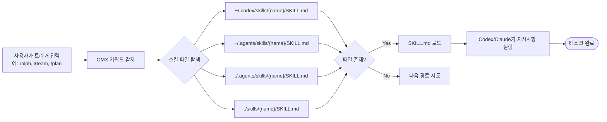

# 스킬 카탈로그

OMX 스킬은 특정 키워드나 `/스킬명` 형태로 호출하는 실행 단위다. 스킬 파일(`SKILL.md`)을 읽어 동작을 정의한다.

---

## 스킬 호출 Mermaid



---

## 스킬 설치 위치

### User scope (전역)

```
~/.codex/skills/{skill-name}/SKILL.md       # Codex CLI 기본
~/.agents/skills/{skill-name}/SKILL.md     # 에이전트 공통
```

### Project scope (프로젝트별)

```
./.codex/skills/{skill-name}/SKILL.md      # 프로젝트 로컬 Codex
./.agents/skills/{skill-name}/SKILL.md    # 프로젝트 로컬 에이전트
```

### 설치 방법

```bash
# User scope 설치 (기본)
omx setup

# Project scope 설치
omx setup --scope project

# 강제 재설치
omx setup --force --verbose

# 설치 확인
omx doctor
```

---

## 워크플로우 스킬

### autopilot

**설명**: 아이디어에서 검증된 코드까지 전체 생애주기를 자율 실행한다.

**트리거 키워드**: `autopilot`, `auto pilot`, `autonomous`, `build me`, `create me`, `make me`, `full auto`, `handle it all`, `I want a/an`

**5단계 파이프라인**:
```
Phase 0: Expansion (요구사항 추출, 기술 명세 작성)
Phase 1: Planning  (구현 계획, Critic 검증)
Phase 2: Execution (Ralph + Ultrawork 병렬 구현)
Phase 3: QA        (UltraQA - 최대 5사이클)
Phase 4: Validation (Architect + Security + Code reviewer)
Phase 5: Cleanup   (상태 파일 정리)
```

**사용 예시**:
```bash
autopilot "build a REST API for bookstore inventory with CRUD using TypeScript"
build me "a CLI tool that tracks daily habits with streak counting"
```

**설정** (`~/.codex/config.toml`):
```toml
[omx.autopilot]
maxIterations = 10
maxQaCycles = 5
maxValidationRounds = 3
pauseAfterExpansion = false
```

---

### plan

**설명**: 인터뷰 또는 직접 모드로 구조화된 작업 계획을 생성한다. consensus 모드(ralplan)와 review 모드를 포함한다.

**트리거 키워드**: `plan this`, `plan the`, `let's plan`, `--consensus`, `ralplan`, `--review`

**모드**:

| 모드 | 트리거 | 동작 |
|------|--------|------|
| Interview | 광범위한 요청 (기본) | 인터랙티브 요구사항 수집 |
| Direct | `--direct` 또는 상세 요청 | 인터뷰 없이 즉시 플랜 생성 |
| Consensus | `--consensus`, `ralplan` | Planner→Architect→Critic 루프 |
| Consensus Interactive | `--consensus --interactive` | 루프 + 사용자 승인 단계 |
| Review | `--review` | Critic이 기존 플랜 평가 |

**사용 예시**:
```bash
plan this "add user authentication"
$plan --consensus "refactor the database layer"
$plan --consensus --interactive "migrate to PostgreSQL"
$plan --review   # 현재 플랜 검토
$ralplan "implement OAuth2"   # consensus 단축키
```

**플랜 저장 위치**: `.omx/plans/`

---

### ralplan

**설명**: `$plan --consensus`의 단축키. Planner, Architect, Critic이 합의할 때까지 반복하는 구조화 계획 워크플로우.

**트리거 키워드**: `ralplan`, `consensus plan`

**플래그**:
- `--interactive`: 초안 검토 및 최종 승인 단계에서 사용자 입력 요청
- `--deliberate`: 고위험 작업용 강화 모드 (pre-mortem 3개 시나리오 + 확장 테스트 계획)

**RALPLAN-DR 구조** (플랜에 반드시 포함):
- Principles (3-5개)
- Decision Drivers (상위 3개)
- Viable Options (2개 이상, pros/cons 포함)
- ADR (Decision, Drivers, Alternatives, Why chosen, Consequences, Follow-ups)

**사용 예시**:
```bash
$ralplan "add user authentication"
$ralplan --interactive "migrate database to PostgreSQL"
$ralplan --deliberate "refactor auth system with security review"
```

---

### team

**설명**: tmux 기반 N명 조율 에이전트로 공유 태스크 목록을 처리한다.

**트리거 키워드**: `team`, `coordinated team`, `omx team`

**호출 형식**:
```bash
omx team [ralph] [N:agent-type] "<task description>"
omx team status <name>
omx team resume <name>
omx team shutdown <name>
```

**사용 예시**:
```bash
omx team 3:executor "analyze feature X and report flaws"
omx team "debug flaky integration tests"
omx team ralph "ship end-to-end fix with verification"
OMX_TEAM_WORKER_CLI=claude omx team 2:executor "update docs"
```

---

### ralph

**설명**: architect 검증이 통과될 때까지 지속 실행하는 persistence loop.

**트리거 키워드**: `ralph`, `don't stop`, `must complete`, `finish this`, `keep going until done`

**주요 특징**:
- 이터레이션마다 상태 저장 (`.omx/state/ralph-state.json`)
- architect 검증 필수 (STANDARD tier 최소)
- "The boulder never stops" - 훅이 이 메시지를 보내면 계속 실행

**사용 예시**:
```bash
$ralph "implement the OAuth2 authentication flow"
$ralph --prd "build a todo app with React and TypeScript"
omx team ralph "implement and verify the full feature"
```

---

### ultrawork

**설명**: 독립 태스크를 동시에 실행하는 경량 병렬 팬아웃 엔진.

**트리거 키워드**: `ulw`, `ultrawork`, `parallel execution`

**tier 선택**:
```bash
# LOW tier - 단순 변경
delegate(role="executor", tier="LOW", task="Add missing type export")

# STANDARD tier - 표준 구현
delegate(role="executor", tier="STANDARD", task="Implement /api/users endpoint")

# THOROUGH tier - 복잡한 분석
delegate(role="executor", tier="THOROUGH", task="Debug race condition in auth")
```

**사용 예시**:
```bash
$ultrawork "refactor all API endpoints in parallel"
/ulw "update README and add tests simultaneously"
```

---

### ultraqa

**설명**: 품질 목표가 달성될 때까지 test → diagnose → fix 사이클을 반복한다.

**트리거 키워드**: `ultraqa`, autopilot Phase 3에서 자동 활성화

**목표 타입**:

| 플래그 | 확인 대상 |
|--------|-----------|
| `--tests` | 모든 테스트 통과 |
| `--build` | 빌드 성공 (exit 0) |
| `--lint` | lint 에러 없음 |
| `--typecheck` | TypeScript 에러 없음 |
| `--custom "pattern"` | 커스텀 성공 패턴 |
| `--interactive` | qa-tester 에이전트로 인터랙티브 테스트 |

**종료 조건**:
- 목표 달성 → `ULTRAQA COMPLETE`
- 5사이클 도달 → `ULTRAQA STOPPED: Max cycles`
- 같은 실패 3회 → `ULTRAQA STOPPED: Same failure 3 times`

**사용 예시**:
```bash
/ultraqa --tests
/ultraqa --build
/ultraqa --custom "All health checks pass"
```

---

### ralph-init

**설명**: Ralph 실행을 위한 구조화된 PRD(Product Requirements Document)를 초기화한다.

**트리거**: `/ralph-init`

**출력**: `.omx/plans/prd-{slug}.md` (문제 정의, 목표, 수락 기준, 기술 제약, 구현 단계 포함)

**사용 예시**:
```bash
/ralph-init "OAuth2 authentication system"
# PRD 생성 후:
/ralph "implement the PRD"
```

---

### swarm

**설명**: `/team` 스킬의 호환성 호환 별칭. 동일한 staged pipeline을 사용한다.

**트리거 키워드**: `swarm`

**사용 예시**:
```bash
/swarm 3:executor "implement features in parallel"
# 위와 동일: /team 3:executor "implement features in parallel"
```

---

### pipeline

**설명**: 설정 가능한 파이프라인 오케스트레이터. 단계를 순차 실행한다.

**기본 파이프라인**:
```
RALPLAN → team-exec → ralph-verify
```

**설정**:
```toml
[omx.autopilot.pipeline]
maxRalphIterations = 10
workerCount = 2
agentType = "executor"
```

---

## 에이전트 단축키

### analyze

**설명**: 아키텍처, 버그, 성능, 의존성에 대한 심층 분석을 수행한다.

**트리거 키워드**: `analyze`, `investigate`, `debug`, `why does`, `what's causing`

**동작**: `ask_codex(agent_role="architect")` 또는 architect 에이전트로 라우팅. 구조화된 분석 결과(파일:라인 참조 포함)를 반환한다.

**사용 예시**:
```bash
analyze "why do WebSocket connections drop after 30 seconds"
investigate "the dependency chain from src/api/routes.ts"
```

---

### tdd

**설명**: Test-Driven Development 강제 워크플로우. 테스트 없이 프로덕션 코드를 작성하지 않는다.

**트리거 키워드**: `tdd`, `test first`, `red green`

**Red-Green-Refactor 사이클**:
```
RED: 실패하는 테스트 먼저 작성 (통과하면 테스트가 잘못된 것)
GREEN: 테스트를 통과시키는 최소한의 코드만 작성
REFACTOR: 코드 품질 개선 (테스트는 계속 green)
REPEAT: 다음 기능으로 반복
```

**사용 예시**:
```bash
/tdd "implement user authentication"
$tdd "add rate limiting to API endpoints"
```

---

### build-fix

**설명**: 빌드 및 TypeScript 에러를 최소한의 변경으로 수정한다. 리팩터링 없이 빌드만 통과시킨다.

**트리거 키워드**: `fix the build`, `build is broken`, TypeScript 컴파일 실패 시

**전략**:
- 타입 어노테이션 추가
- null 체크 추가
- import/export 수정
- 모듈 경로 수정
- 리팩터링/아키텍처 변경 없음

**사용 예시**:
```bash
/build-fix
$build-fix "resolve TypeScript errors in src/api/"

# 다른 스킬과 조합
/ultrawork fix all build errors   # 병렬 파일별 수정
/ralph fix the build               # 통과까지 반복
```

---

### code-review

**설명**: 코드 품질, 보안, 유지보수성에 대한 종합 코드 리뷰를 수행한다.

**트리거 키워드**: `review this code`, `code review`

**리뷰 카테고리**: 보안, 코드 품질, 성능, 베스트 프랙티스, 유지보수성

**심각도 등급**:
- `CRITICAL`: 보안 취약점 (머지 전 반드시 수정)
- `HIGH`: 버그 또는 주요 코드 냄새
- `MEDIUM`: 소규모 이슈
- `LOW`: 스타일/제안

**승인 기준**:
- `APPROVE`: CRITICAL/HIGH 없음
- `REQUEST CHANGES`: CRITICAL/HIGH 존재
- `COMMENT`: LOW/MEDIUM만 있음

**사용 예시**:
```bash
/code-review
/ultrawork review all files in src/   # 병렬 리뷰
/ralph code-review then fix all issues
```

---

### security-review

**설명**: OWASP Top 10, 하드코딩된 시크릿, 안전하지 않은 패턴에 대한 보안 감사를 수행한다.

**트리거 키워드**: `security review`, `security audit`

**점검 항목**:
- OWASP Top 10 (A01~A10)
- 하드코딩된 API 키/비밀번호
- 입력 검증 (SQL/NoSQL/Command injection)
- 인증/인가
- 의존성 취약점 (`npm audit`)

**심각도 대응 시간**:
- CRITICAL: 즉시 (1시간 이내)
- HIGH: 긴급 (24시간 이내)
- MEDIUM: 계획적 (1개월 이내)
- LOW: 백로그

**사용 예시**:
```bash
/security-review
/team "run security review on authentication module"
/ralph security-review then fix all issues
```

---

### review

**설명**: `$plan --review`의 단축키. 기존 플랜을 Critic이 평가한다.

**트리거 키워드**: `review plan`, `critique plan`

**사용 예시**:
```bash
/review   # .omx/plans/의 현재 플랜 검토
```

---

## 알림/유틸리티 스킬

### configure-notifications

**설명**: Discord, Telegram, Slack, 커스텀 webhook 등 OMX 알림의 통합 설정 진입점.

**트리거 키워드**: `configure discord`, `setup discord`, `discord webhook`, `configure telegram`, `setup telegram`, `telegram bot`, `configure slack`, `setup slack`, `configure notifications`

**지원 플랫폼**:
- Discord (native webhook 또는 bot)
- Telegram (bot token + chat id)
- Slack (incoming webhook)
- `custom_webhook_command` (일반 HTTP webhook)
- `custom_cli_command` (CLI 명령어)

**설정 파일**: `~/.codex/.omx-config.json`

**사용 예시**:
```bash
configure discord
setup telegram
configure slack webhook
```

---

### omx-setup

**설명**: oh-my-codex를 현재 프로젝트와 사용자 디렉토리에 설치/갱신한다.

**트리거**: `omx setup`, `setup omc`

**플래그**:
```bash
omx setup [--force] [--dry-run] [--verbose] [--scope <user|project>]
```

**설치 내용**:
1. 디렉토리 및 scope 설정
2. 프롬프트, 에이전트 설정, 스킬, config.toml 설치
3. Team CLI API interop 마커 검증
4. `./AGENTS.md` 생성 (templates/AGENTS.md 기반)
5. notify 훅 설정, `.omx/hud-config.json` 작성

**사용 예시**:
```bash
omx setup --force --verbose
omx doctor   # 설치 확인
```

---

### cancel

**설명**: 활성 OMX 모드(autopilot, ralph, ultrawork, ultraqa, team 등)를 지능적으로 취소한다.

**트리거**: `/cancel`, `cancelomc`, `stopomc`

**취소 순서**:
1. Autopilot (linked ralph/ultraqa 포함)
2. Ralph (linked ultrawork 포함)
3. Ultrawork (standalone)
4. UltraQA (standalone)
5. Swarm (standalone)
6. Team (tmux graceful shutdown)
7. Plan Consensus (standalone)

**상태 보존**:

| 모드 | 상태 보존 | 재개 커맨드 |
|------|-----------|------------|
| Autopilot | 보존 (페이즈, 파일) | `/autopilot` |
| Ralph | 보존 안 함 | N/A |
| Ultrawork | 보존 안 함 | N/A |
| UltraQA | 보존 안 함 | N/A |
| Team | 보존 안 함 | N/A |

```bash
/cancel           # 현재 세션 스마트 취소
/cancel --force   # 전체 state 파일 강제 정리
/cancel --all     # --force와 동일
```

---

### hud

**설명**: OMX HUD(상태 표시줄)를 표시하거나 설정한다. 두 레이어 아키텍처로 구성.

**Layer 1**: Codex 내장 statusLine (TUI 하단, `~/.codex/config.toml`으로 설정)
**Layer 2**: `omx hud` CLI (Ralph, Ultrawork, Team 등 오케스트레이션 상태)

**커맨드**:
```bash
omx hud               # 현재 상태 표시
omx hud --watch       # 실시간 업데이트 (1초 폴링)
omx hud --json        # 스크립팅용 raw state
omx hud --preset=minimal    # [OMX] ralph:3/10 | turns:42
omx hud --preset=focused    # 기본값
omx hud --preset=full       # 모든 정보
```

**색상 코딩**:
- Green: 정상
- Yellow: 경고 (ralph >70%)
- Red: 위험 (ralph >90%)

---

### note

**설명**: 대화 compaction에서 살아남는 중요 컨텍스트를 `.omx/notepad.md`에 저장한다.

**사용 방법**:
```bash
/note Found auth bug in UserContext        # Working Memory에 추가
/note --priority "Project uses pnpm"      # Priority Context (항상 로드)
/note --manual "API team: api@company.com" # MANUAL (영구 보존)
/note --show                               # 현재 notepad 표시
/note --prune                             # 7일 이상 항목 삭제
```

**섹션**:
- Priority Context: 세션 시작 시 항상 주입 (최대 500자)
- Working Memory: 타임스탬프, 7일 후 자동 삭제
- MANUAL: 영구 보존, 자동 삭제 없음

---

### trace

**설명**: 세션 내 에이전트 플로우 타임라인과 요약 통계를 표시한다.

**트리거**: `/trace`

**출력 내용**:
- 훅, 키워드, 스킬, 에이전트, 도구 간 상호작용 타임라인
- 훅 발화 횟수, 감지된 키워드, 활성화된 스킬
- 모드 전환, 도구 성능 병목점

**사용 예시**:
```bash
/trace   # 전체 타임라인 + 요약
```

---

### deepsearch

**설명**: 코드베이스를 광범위하게 검색하는 심층 탐색 모드.

**트리거**: `/deepsearch`

**전략**:
1. 정확한 일치 + 관련 용어/변형 검색
2. 매칭 파일 읽기, import/export 추적
3. 개념 사용 위치 매핑

**출력 포맷**:
- Primary Locations (주요 구현체)
- Related Files (의존성, 소비자)
- Usage Patterns (코드베이스 전반 사용 방식)
- Key Insights (패턴, 관례, 주의사항)

---

### doctor

**설명**: OMX 설치 상태를 진단한다.

**커맨드**:
```bash
omx doctor
```

**확인 항목**:
- 프롬프트 설치 (scope별)
- 스킬 설치 (scope별)
- AGENTS.md 존재
- `.omx/state` 존재
- MCP 서버 설정 (`config.toml`)

---

### ask-claude / ask-gemini

**설명**: Claude 또는 Gemini에게 특정 질문을 위임하는 스킬.

**사용 예시**:
```bash
/ask-claude "explain this architecture decision"
/ask-gemini "review this code snippet"
```

---

### worker

**설명**: tmux 팀 워커 프로토콜. `omx team`이 생성한 tmux pane에서 실행되는 Codex/Claude 세션이 사용한다.

**자동 활성화**: `OMX_TEAM_WORKER` 환경변수가 설정된 세션에서

**프로토콜**:
1. inbox.md 읽기
2. 리더에게 ACK 전송 (`omx team api send-message`)
3. 태스크 클레임 (`omx team api claim-task`)
4. 작업 수행
5. 태스크 완료/실패 전환 (`omx team api transition-task-status`)
6. status.json 업데이트 (`state: "idle"`)

---

### ai-slop-cleaner

**설명**: AI가 생성한 불필요한 코드 패턴(boilerplate, excessive comments 등)을 정리한다.

**트리거**: `/ai-slop-cleaner`

---

### deep-interview

**설명**: Socratic 방식의 심층 요구사항 인터뷰. 모호한 요청을 명확화한다.

**플래그**: `--quick` (컴팩트 패스)

**사용 예시**:
```bash
$deep-interview "build user authentication"
$deep-interview --quick "add OAuth2"
```

---

### visual-verdict

**설명**: 스크린샷/디자인 레퍼런스와 현재 구현을 비교해 시각적 점수를 매긴다.

**출력**: `score`, `verdict`, `category_match`, `differences[]`, `suggestions[]`, `reasoning`

**기본 합격 기준**: `score >= 90`

**ralph와 연계**:
```bash
$ralph -i refs/design.png "match this design"
# ralph가 매 편집 전 $visual-verdict 자동 실행
```

---

### web-clone

**설명**: 대상 URL을 분석해 UI를 클론한다. 내부적으로 `$visual-verdict`를 사용한다.

**사용 예시**:
```bash
$web-clone "https://example.com"
ralph "clone https://example.com"   # ralph가 $web-clone 자동 호출
```

---

### frontend-ui-ux

**설명**: 프론트엔드 UI/UX 아키텍처 및 인터랙션 디자인 전문 스킬.

---

### git-master

**설명**: git 워크플로우 마스터. 브랜치 전략, 커밋 메시지, PR 작성을 포함한다.

---

### ecomode

**설명**: `ultrawork`의 구버전 별칭. 토큰 효율적 병렬 실행 모드. 현재는 `ultrawork`로 통합되었다.

**주의**: deprecated. `ultrawork`를 사용하라.

---

## 커스텀 스킬 만들기

### 스킬 구조

```
~/.codex/skills/my-skill/
└── SKILL.md
```

### SKILL.md 형식

```markdown
---
name: my-skill
description: 스킬의 한 줄 설명
triggers:
  - "trigger keyword"
  - "another trigger"
---

# My Skill

## Purpose
이 스킬이 하는 일

## Usage
/my-skill <arguments>

## Steps
1. 첫 번째 단계
2. 두 번째 단계

## Example
$my-skill "do something"
```

### 커스텀 스킬 설치

```bash
# 1. 스킬 디렉토리 생성
mkdir -p ~/.codex/skills/my-skill

# 2. SKILL.md 작성
cat > ~/.codex/skills/my-skill/SKILL.md << 'EOF'
---
name: my-skill
description: My custom skill
---
# My Skill
...
EOF

# 3. 설치 확인
omx doctor
```

### 프로젝트 스코프 커스텀 스킬

```bash
# 프로젝트별 스킬 (팀 공유 가능)
mkdir -p ./.agents/skills/project-skill
# SKILL.md 작성 후
git add .agents/skills/project-skill/SKILL.md
git commit -m "Add project-scoped custom skill"
```

💡 **팁**: 커스텀 스킬은 `/skill` 스킬로 관리할 수 있다. `/skill list`로 설치된 스킬 목록을 확인하고, `/skill add <name>` 으로 새 스킬을 추가한다.

---

## 전체 스킬 목록 요약

| 스킬 | 카테고리 | 트리거 | 한 줄 설명 |
|------|---------|--------|-----------|
| autopilot | 워크플로우 | `build me`, `autopilot` | 아이디어 → 코드 전체 자동화 |
| plan | 워크플로우 | `plan this`, `let's plan` | 구조화된 작업 계획 생성 |
| ralplan | 워크플로우 | `ralplan`, `consensus plan` | plan --consensus 단축키 |
| team | 워크플로우 | `omx team` | tmux 멀티 에이전트 오케스트레이션 |
| ralph | 워크플로우 | `ralph`, `don't stop` | 완료 보장 persistence loop |
| ultrawork | 워크플로우 | `ulw`, `ultrawork` | 병렬 팬아웃 엔진 |
| ultraqa | 워크플로우 | `ultraqa` | QA 자동 사이클링 |
| ralph-init | 워크플로우 | `/ralph-init` | PRD 초기화 |
| swarm | 워크플로우 | `swarm` | team의 호환성 별칭 |
| pipeline | 워크플로우 | `pipeline` | 순차 스테이지 파이프라인 |
| analyze | 에이전트 단축키 | `analyze`, `investigate` | 심층 분석 및 디버깅 |
| tdd | 에이전트 단축키 | `tdd`, `test first` | TDD 워크플로우 강제 |
| build-fix | 에이전트 단축키 | `fix the build` | 빌드 에러 최소 수정 |
| code-review | 에이전트 단축키 | `code review` | 종합 코드 리뷰 |
| security-review | 에이전트 단축키 | `security review` | 보안 감사 |
| review | 에이전트 단축키 | `review plan` | 플랜 review 단축키 |
| configure-notifications | 유틸리티 | `configure discord` 등 | 알림 설정 통합 진입점 |
| omx-setup | 유틸리티 | `omx setup` | OMX 설치/갱신 |
| cancel | 유틸리티 | `/cancel`, `cancelomc` | 활성 모드 지능적 취소 |
| hud | 유틸리티 | `omx hud` | 오케스트레이션 상태 표시 |
| note | 유틸리티 | `/note` | compaction 생존 메모 |
| trace | 유틸리티 | `/trace` | 에이전트 플로우 타임라인 |
| deepsearch | 유틸리티 | `/deepsearch` | 코드베이스 심층 탐색 |
| doctor | 유틸리티 | `omx doctor` | 설치 상태 진단 |
| worker | 내부 | 자동 (OMX_TEAM_WORKER) | 팀 워커 프로토콜 |
| ask-claude | 도구 | `/ask-claude` | Claude에 직접 질문 |
| ask-gemini | 도구 | `/ask-gemini` | Gemini에 직접 질문 |
| ai-slop-cleaner | 도구 | `/ai-slop-cleaner` | AI 생성 boilerplate 정리 |
| deep-interview | 도구 | `/deep-interview` | Socratic 요구사항 명확화 |
| visual-verdict | 도구 | `$visual-verdict` | 시각적 구현 점수 평가 |
| web-clone | 도구 | `$web-clone` | URL UI 클론 |
| frontend-ui-ux | 전문 | `/frontend-ui-ux` | 프론트엔드 UI/UX 전문 |
| git-master | 전문 | `/git-master` | Git 워크플로우 마스터 |
| skill | 메타 | `/skill` | 스킬 관리 |
| ecomode | deprecated | `ecomode` | ultrawork로 통합됨 |
