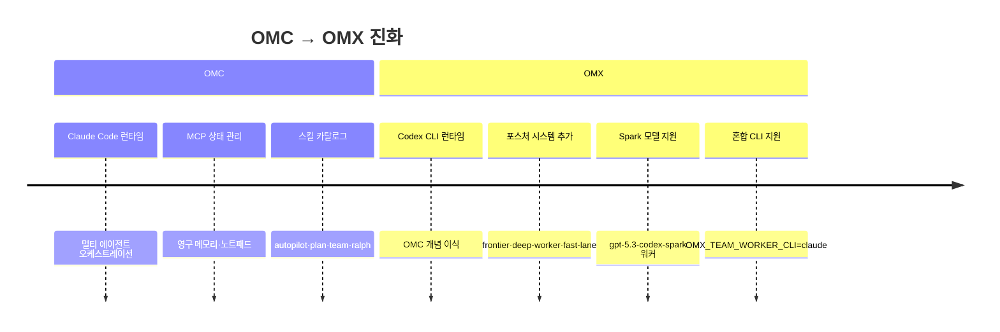

# OMX vs OMC (oh-my-claudecode) 비교

oh-my-codex(OMX)와 oh-my-claudecode(OMC)는 같은 저자(Yeachan-Heo)가 만든 에이전트 오케스트레이션 런타임이다. OMX는 OMC에서 영감을 받아 OpenAI Codex CLI 전용으로 설계되었다.

---

## 1. 공통 기원

- **같은 저자:** Yeachan-Heo
- **공통 철학:** Codex/Claude CLI를 그대로 실행 엔진으로 유지하고, 오케스트레이션 레이어를 그 위에 추가
- **OMX는 OMC의 아이디어를 Codex 생태계에 이식한 프로젝트**
- 스킬 이름, 에이전트 역할 이름, 디렉토리 구조가 의도적으로 유사하게 설계됨
- 두 프로젝트 모두 `.omc/` / `.omx/` 를 런타임 상태 디렉토리로 사용하는 동일한 패턴을 따름

---

## 2. 핵심 차이점 비교표

| 항목 | oh-my-claudecode (OMC) | oh-my-codex (OMX) |
|------|----------------------|-------------------|
| 대상 CLI | Claude Code | OpenAI Codex CLI |
| 주요 커맨드 | `claude` (내장) | `omx` |
| 상태 디렉토리 | `.omc/` | `.omx/` |
| 설정 파일 | `settings.json` | `config.toml` |
| 스킬 설치 위치 | `~/.claude/plugins/` | `~/.agents/skills/` |
| 프롬프트 위치 | `~/.claude/prompts/` | `~/.codex/prompts/` |
| 에이전트 정의 방식 | `subagent_type` (Task 도구) | `--agent-prompt` 플래그 |
| 워커 기본 모델 | Claude 모델군 | GPT 모델군 (+ Claude 혼용 가능) |
| 포스처 시스템 | 없음 | `frontier-orchestrator` / `deep-worker` / `fast-lane` |
| Spark 모델 | 없음 | `gpt-5.3-codex-spark` (경량 고속 워커용) |
| 팀 모드 진입 | `Task(subagent_type=...)` | `omx team N:role "task"` |
| MCP 서버 | 내장 OMC MCP | `omx-state`, `omx-memory`, `omx-code-intel`, `omx-trace` |
| 네이티브 에이전트 설정 | 없음 | `~/.omx/agents/*.toml` |
| 훅 확장 | 있음 | 있음 (`.omx/hooks/*.mjs`) |
| tmux 요구사항 | 선택적 | 팀 모드에 필수 |
| Windows 지원 | 제한적 | psmux 통해 지원 |

---

## 3. 개념적 공통점


두 시스템은 동일한 레이어 구조를 가진다:
- **실행 플레인:** Claude/Codex 가 실제 에이전트 작업 수행
- **제어 플레인:** OMC/OMX 가 팀 워커, 생명주기, HUD, 복구를 관리
- **상태 플레인:** MCP 서버가 상태, 메모리, 진단, 프로젝트 컨텍스트를 지원

---

## 4. 스킬 이름 대조표

같은 이름의 스킬이 두 플랫폼에 모두 존재하며, 각각의 런타임에서 동일한 워크플로우를 수행한다.

| 스킬 이름 | OMC 동작 | OMX 동작 |
|----------|---------|---------|
| `$autopilot` | 아이디어→코드 완전 자율 실행 | 동일 |
| `$plan` | 전략적 계획 수립 (합의/리뷰 모드 포함) | 동일 |
| `$team` | N개 Claude 에이전트 팀 조율 | N개 Codex 에이전트 팀 조율 |
| `$ralph` | 자기 참조 지속 루프 실행 | 동일 |
| `$ultrawork` | 최대 병렬 에이전트 실행 | 동일 |
| `$ralplan` | 합의 기반 계획 (`$plan --consensus`) | 동일 |
| `$configure-notifications` | Discord/Telegram/Slack 설정 | 동일 |

**호출 방식 비교:**

```bash
# OMC (Claude Code 세션 내부)
$team 3:executor "implement the feature"
$plan "design the auth system"

# OMX (Codex 세션 내부)
$team 3:executor "implement the feature"
$plan "design the auth system"
```

스킬 이름이 동일하므로 두 시스템 간 워크플로우 전환이 쉽다.

---

## 5. 에이전트 프롬프트 차이

### OMC 에이전트 호출 방식

OMC는 `Task` 도구의 `subagent_type` 매개변수로 에이전트를 지정한다:

```
# OMC 내부 (Claude Code 세션)
Task(subagent_type="oh-my-claudecode:executor", prompt="implement feature")
Task(subagent_type="oh-my-claudecode:planner", model="opus", prompt="plan the refactor")
```

### OMX 에이전트 호출 방식

OMX는 `omx ask` 커맨드의 `--agent-prompt` 플래그 또는 세션 내 `/prompts:` 접두어를 사용한다:

```bash
# OMX 커맨드라인
omx ask claude --agent-prompt executor "implement feature X"
omx ask gemini --agent-prompt planner "plan the refactor"

# OMX 세션 내부
/prompts:executor "implement feature X"
/prompts:planner "plan the refactor"
```

### 포스처 시스템 (OMX 전용)

OMX에는 OMC에 없는 포스처(posture) 라우팅 레이어가 있다:


---

## 6. 어떤 걸 선택해야 하나?

### Claude API 사용 → OMC 선택

```
- Anthropic Claude API 구독이 있는 경우
- Claude Code CLI를 이미 사용 중인 경우
- Anthropic 생태계(Claude 모델군) 중심으로 작업하는 경우
```

### OpenAI Codex API 사용 → OMX 선택

```
- OpenAI API 키를 보유한 경우
- GPT 모델군(gpt-5.4, gpt-5.3-codex 등)을 사용하는 경우
- Spark 모델(gpt-5.3-codex-spark)의 고속 워커가 필요한 경우
- Windows 환경에서 psmux 지원이 필요한 경우
```

### 혼합 사용 → OMX + `OMX_TEAM_WORKER_CLI=claude`

OMX는 팀 워커로 Claude CLI를 사용하도록 설정할 수 있다:

```bash
# 리더는 Codex, 워커는 Claude
OMX_TEAM_WORKER_CLI=claude omx team 3:executor "implement feature"

# Codex를 리더로, Claude를 분석 워커로 혼합 사용
omx ask claude --agent-prompt architect "review system design"
omx ask gemini --agent-prompt executor "implement the reviewed design"
```

이 방식으로 두 모델의 강점을 작업에 따라 혼합 활용할 수 있다.

---

## 7. 마이그레이션 고려사항

OMC 사용자가 OMX로 전환할 때 고려할 점:

### 설정 파일 변환

| OMC | OMX | 조치 |
|-----|-----|------|
| `~/.claude/settings.json` | `~/.codex/config.toml` | 형식 변환 필요 (JSON → TOML) |
| `.omc/` 상태 디렉토리 | `.omx/` 상태 디렉토리 | 새로 초기화 |
| `~/.claude/plugins/` 스킬 | `~/.agents/skills/` 스킬 | `omx setup` 으로 재설치 |

### 워크플로우 전환

```bash
# OMC 팀 실행
# (Claude Code 내부) $team 3:executor "task"

# OMX 팀 실행 (동등)
omx team 3:executor "task"
```

### 스킬 재설치

OMC 스킬을 OMX로 가져오려면 `omx setup` 을 실행하여 OMX 스킬 카탈로그를 새로 설치한다:

```bash
omx setup
omx doctor
```

### 에이전트 프롬프트 재사용

두 시스템의 에이전트 프롬프트 파일(`executor.md`, `planner.md` 등)은 구조가 거의 동일하다. OMC 프롬프트를 `~/.codex/prompts/` 에 복사하면 OMX에서도 사용할 수 있다.

### 주의사항

- `subagent_type` 방식은 OMX에서 지원되지 않음 — `--agent-prompt` 플래그 방식으로 전환 필요
- OMC의 `settings.json` MCP 설정을 OMX `config.toml` 형식으로 수동 변환 필요
- 팀 모드에서 tmux가 필수임을 확인 (`omx doctor --team`)

> 💡 팁: OMC와 OMX를 동시에 설치해도 충돌하지 않는다. 상태 디렉토리(`.omc/` vs `.omx/`)와 설정 디렉토리가 분리되어 있기 때문이다.

---

## 8. 아키텍처 진화 방향



OMX는 OMC의 핵심 개념을 유지하면서 Codex 생태계에 맞게 확장하고, 포스처 시스템이라는 새로운 라우팅 레이어를 추가했다.
